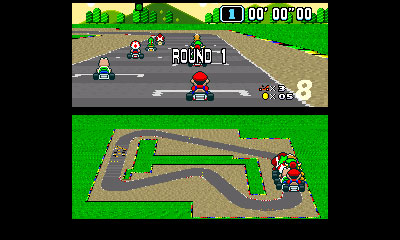
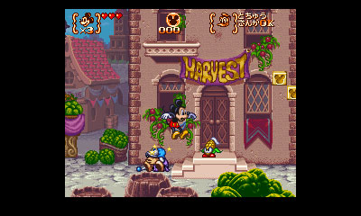
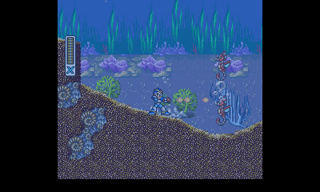
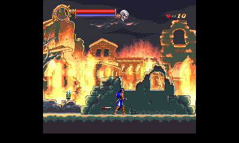

## Snes9x for 3DS

Snes9x for 3DS is a high-compatibility SNES emulator for your Old 3DS / 2DS. It runs many games at full speed (60 fps). It supports games that use CX4 chip (Megaman X2/X3), and the SDD-1 chip (Star Ocean, Super Street Fighter 2 Alpha). It can also play games that use the SuperFX chip (Yoshi's Island, etc), and the SA-1 chip (Super Mario RPG, Kirby's Dreamland, Kirby Super Star) but it runs slowly. It generally supports higher compatibility than existing SNES emulators on the old 3DS, because it uses Snes9x 1.43 as a base, and is a good alternative if your existing emulators cannot play all games.

It also runs on your New 3DS, and performs much faster! Use your New 3DS if you want to play SuperFX and SA-1 games!

Download the latest from:
   https://github.com/bubble2k16/snes9x_3ds/releases

Give feedback / report bugs here:
   https://gbatemp.net/threads/snes9x-for-old-3ds.435568/

To use:

### Homebrew Launcher:

1. Copy Snes9x_3ds.3dsx, Snes9x_3ds.smdh, snes9x_3ds_top.png into the /3ds/snes9x_3ds on your SD card.
2. Place your SNES ROMs inside any folder.
3. Go to your Homebrew Launcher (either via Cubic Ninja, Soundhax or other entry points) and launch the snes9x_3ds emulator.

### CIA Version:

1. Use your favorite CIA installer to install snes9x_3ds.cia into your CFW. You can also use FBI to download from TitleDB.
2. Place your SNES ROMs inside any folder.
3. Copy snes9x_3ds_top.png to ROOT of your SD card.
4. Exit your CIA installer and go to your CFW's home screen to launch the app.

### When in-game,

1. Tap the bottom screen for the menu.
2. Use Up/Down to choose option, and A to confirm.
   (Hold down X while pressing Up/Down to Page Up/Page Down)
3. Use Left/Right to change between ROM selection and emulator options.
4. You can quit the emulator to your homebrew launcher / your CFW's home screen.

Feedback and bug reports are welcome. Help with development is also welcome!

-------------------------------------------------------------------------------------------------------

## Screenshots


Seiken Densetsu 3 (English Patch)


Secret of Mana



Super Mario Kart



Disney's Magical Quest 3 Starring Mickey & Donald


Mighty Morphin Power Rangers - The Fighting Edition



Megaman X


Megaman X3



Castlevania - Dracula X

-------------------------------------------------------------------------------------------------------

## Frequently Asked Questions

### Why do some games have strange color issues (for eg., Wild Guns, Kirby Super Star, Judge Dredd, Batman Forever, Secret of Mana, Kirby Super Star)?

Try going to the Settings and change the In-Frame Palette Changes to either one of the 3 options: Enabled, Disabled Style 1, Disabled Style 2. Color emulation is never perfect because we are using the 3DS GPU for rendering, which doesn't allow us to do what the SNES requires.

### Why do some games keep writing to the SD Card every second or so (for eg., Treasure Hunter G, Some Super Mario Hacks, Final Fantasy Mystic Quest)?

Try going to the Settings and change the SRAM Auto-Save Delay to 10 seconds, 60 seconds, or disable it entirely! Don't worry, the SRAM will be saved again when you tap on the bottom screen.

### Why can't I load some games? They are lised as supported on the compatibility list!

Ensure that your ROM file is not a zipped file. Currently, the emulator only supports .SFC, .SMC, .FIG formats.

### Can I use my save states generated from Windows versions of Snes9x?

You can try using save states from Snes9x v1.43, but sometimes this emulator doesn't recognize them.

### How can I make Snes9x utilize the full speed of the New 3DS?

The .3DSX version currently uses the full clock speed of the New 3DS, enabling all your SuperFX, SA-1 games to run faster.

### After closing the lid and re-opening it, the sound synchronization during game emulation is off!

Yes, this is a known issue. You can try to tap the bottom to bring up the menu, and then resume your game. The sound should become synchronized again.

### After pressing the Home button, the emulator music still plays!

Try to avoid pressing the Home button or putting the 3DS to sleep. Quit the emulator entirely from the emulator's menu before going to the Home screen.

-------------------------------------------------------------------------------------------------------

## What's supported

1. Graphic modes 0 - 7.
2. Save states of up to 4 slots
3. Cheats - place your .CHT/.CHX (text format) with the same filename in the same folder as your ROM. For example, if your ROM name is MyGame.smc, then your cheat file should be named MyGame.CHT or MyGame.CHX
4. Currently uses CSND for audio. So your entry point to home-brew must be able to use CSND. If you can play BlargSNES with sound, you should be able to play Snes9X_3DS with sound.
5. Frame skipping.
6. Stretch to full screen / 4:3 ratio
7. PAL (50fps) / NTSC (60 fps) frame rates.
8. Navigation of ROMs in different folders.
9. SDD1 chip (Street Fighter 2 Alpha, Star Ocean)
10. SFX1/2 chip (Yoshi's Island, but slow on old 3DS)
11. CX4 chip (Megaman X-2, Megaman X-3)
12. DSP chips (Super Mario Kart, Ace o Nerae)
13. SA-1 chip (Super Mario RPG, Kirby Superstar)
14. Use of full clock speed in the New 3DS.
15. Sound emulation (at 32KHz, with echo and gaussian interpolation)
16. Automatic saving and reloading of savestates.

## What's missing / needs to be improved

1. Minor sound emulation errors.
2. Mosaics.
3. In-frame palette changes - This is because this emulator uses the 3DS GPU for all graphic rendering. Without in-frame palette changes implemented, a small number of games experience colour issues.

-------------------------------------------------------------------------------------------------------

## Change History

v1.30
- Improved sound synchronization.
- Added BlargSNES DSP Core (experimental) for performance. The original Snes9X DSP core (default) suffers from sound skipping in some games like Aladdin and Gradius 3. You can choose which DSP core to use from the Options menu. The BlargSNES DSP Core sounds similar to the Snes9x Core for most games. Sounds like Final Fantasy 3's the howling wind sound different.
- Added support for Tengai Makyou Zero English Patch (for hopefully all future versions)

v1.21
- Fixed the ZL/ZR button problem when installing the CIA version.

v1.20
- Fixed slider problem in New 3DS (where one of the eyes always sees a black screen)
- Added button mappings and rapid fire settings like VirtuaNES / TemperPCE 3DS (thanks to AdmiralCurtiss)
- Added button configuration to open emulator menu and fast-forward (thanks to AdmiralCurtiss). Use with care, though. In some games, fast-forwarding can freeze/corrupt your game.
- Added a frame rate option to v-sync with the 60Hz 3DS refresh rate (thanks AdmiralCurtiss)
- Added an option to auto-save state when exiting and loading when starting a new game. (thanks AdmiralCurtiss)
- Added an option to force saving of SRAM, required by Yoshi's Island. (thanks AdmiralCurtiss)
- Show 3DS battery level in the bottom right of the menu (thanks ramzinouri)
- Increased scrolling speed in menu when holding down the D-pad.
- Added memory mapper support for Tengai Makyou Zero English Patch (version 1.0 released 22 Oct 2017)
- Supports most original BS Zelda (1-4, Map 2 1-4, Ancient Stone Tablets 1-4), except for the Remix version which still boots into black screen (thanks ramzinouri)
- And other text changes (thanks FateForWindows)

v1.11
- Fixed crashing bug when loading CHX cheat files.

v1.10
- Implemented SA-1 sleep speed-hacks on the following games. These games run faster and some are able to run at 60 fps on the Old 3DS when things on-screen aren't too busy.
   Super Mario RPG; Kirby’s Dreamland; Jikkyou Oshaberi Parodius; Kirby Super Star; Marvelous; Super Robot Taisen;
   Panic Bomber World; Dragon Ball Hyper Dimension; SD Gundam Next; Power Rangers Zeo;
   Daisenryaku Expert 2; Masters New Augusta 3; Bass Fishing; J96 Dream Stadium;
   Shining Scorpion; Pebble Beach New; PGA European Tour; SD F1 Grand Prix;
- Fixed mode 7’s CLIP_10_BIT_SIGNED formula to use the original Snes9x’s formula. This fixes Super Chase HQ’s mode 7 intro.
- Imported SPC7110 decompressor chip code from Snes9x 1.52. Now Tengai Makyou Zero (Far East of Eden Zero) can boot after 2 restarts, and in-game graphics appears without problems.
- Fixed important bug in cheat engine so that it doesn't not increment the 65816 processor's clock cycles when enabling/disabling cheats.
- Fixed the problem of the menu not using the correct font when the emulator first boots up.
- Added one more mode when using the 3D slider for a sharper image.
- Major refactoring of code.
- Fixed SA1 MMC's memory map code by copying it from Snes9x 1.54.2. Now Super Mario World hack VLDC 9 boots.
- Fixed Mode 0 rendering bug. The original bug was there since day 1 and with this fix, Lagoon's title screen looks right.


v1.00
- Transplanted the full SPC700 + DSP source codes from Snes9x v1.51 into this emulator. As a result, the sound emulation now supports Gaussian Interpolation, and has better accuracy. This fixes some sound problems in Clay Fighter and Mortal Kombat I and II.
- Fixed Mode 7 priorities in games that use this: Contra III's stage 1 (at the loss of some color fidelity). Implementing this required the use of some crazy math hacks and hardware tricks to pull this off.
- Implemented some experimental speed hacks for Super Mario RPG and Kirby's Dreamland. Runs slightly faster (still not full speed) on Old 3DS.
- Implemented hi-res translucency. We get non-flickering emulation of hi-res screens (Secret of Mana, Seiken Densetsu 3, A.S.P. Air Strike Patrol) now as a bonus. As a result, Kirby's Dreamland is now playable.
- Invented a new cheat file format .CHX (text file) so that players can add cheats by using any text editor.
- Centralized the SNES output screen vertically on the top screen.
- Overhauled the user interface to give a more modern look as well as provide additional fonts.
- Added more screen stretch options as requested by many users.
- Added 3D slider support. Pushing up the 3D slider doesn't create any 3D effect, but may create a better viewing experience.
- Removed unnecessary debug messages during start up / shut down of the emulator.
- Fixed a bug when the SRAM still saves randomly when it is set to Disabled.
- Reduced memory footprint for storing texture position caches.
- Made this version buildable with libctru v1.2.0 (thanks to Maki-chan)
  [Note: Building with devkitARM r46 and libctru v1.2.0 will cause a bug where the emulator cannot utilize the full clock speed of the New 3DS.]

v0.80
- Fixed NMI interrupt for specific games such as Cu-On-Pa. This allows Cu-On-Pa to get past the selection screen.
- Fixed ROM size calculation for Wonder Project J (English Patch). The game no longer hangs at the menu.
- Implemented optimized rendering for offset-per-tile modes. This gives many games a major performance boost. Games such as Strike Gunner STG, Tetris Attack, Kirby's Avalanche, Contra's Stage 1 Boss, Super Mario All-Stars' Super Mario 2 all benefit from this improvement.
- Implemented optimized rendering for sprites for modest performance boost.
- Used SPC700 core from Snes9x v1.51.
- Re-implemented an moderately optimized SA-1 core. Now games like Kirby Super Star, Super Mario RPG can boot. It will NOT run well on the old 3DS currently, but it will run smooth on a new 3DS with full clock speed.

v0.71
- Fixed nasty bug that breaks loading of the second ROM, if the first ROM was loaded from a directory path that has spaces in it.
- Added feature to allow users to page up/down the options in the menu while holding down X.
- Minor optimizations

v0.70
- Fixed sprites priority issues. This fixes sprites problems of Shadowrun, Chrono Trigger, Super Mario All Stars' (and possibly other games too)
- The newly implemented rendering engine also provides some modest speed improvements in some games.
- Added feature to save the directory of the previously loaded ROM.

v0.63
- Fixed bug in DMA when the source address comes from Save RAM. This fixes a number of Super Mario World Hacks so that text is readable on BG layer 3.
- Fixed menu key lock issue to improve usability when exiting from menu back into the game.
- Fixed DKC tile corruption issue. This probably also fixes most (if not all) tile corruption issues in other games, if you play a game for too long in a single sitting.
- Fixed sound problems when auto-saving SRAM. Somehow the hardware or the library doesn't like us stopping and starting the CSND too often. Not too sure what the problem is.
- Added an auto-save SRAM option to tell the emulator when to save SRAM (1 second, 10 seconds, 60 seconds, or disable auto-save).
Note that regardless of the setting, the emulator will always save any modified SRAM every time you touch the bottom screen to activate the menu.

v0.62
- Improved Mode 7 zoomed-in textures. Games like Seiken Densetsu, ActRaiser 1/2 look better when viewing the Mode 7 textures near to the ground. Thanks for Discostew for the motivation!
- Improved sound handling to ensure that the left speaker plays at the same volume as the right speaker.
- Added option to change in-frame palette handling. There are three options to choose from:
   > Enabled. (Slow, accurate, but never as accurate as software)
   >  Disabled Style 1 (faster, less accurate)
   > Disabled Style 2 (faster, less accurate) works a little differently from Style 1
  Most games are by default Disabled Style 2.
  Bahamut Lagoon and Front Mission Gun Hazard are by default Disabled Style 1.
  Wild Guns, Judge Dredd, Batman Forever are by default Enabled.
- Fixed Clock Tower to boot properly again.
- Fixed Star Fox flickering problem when there are frameskips.
- Fixed outside-of-track texture problem with Super Mario Kart’s Bowser Castle stages.
- Fixed Final Fantasy V Intro logo cutout problem.
- Fixed Donkey Kong Country's tile colour corruption bug

v0.61
- Fixed DSP bug that causes some games like Dragon Ball - Super Budoten 3, Umihara Kawase to mute.
- Fixed bug that doesn't stop sound from playing when saving to SRAM.

v0.6
- Default sound amplification to 2x  …
- Reduced GPU freezing problem after loading new ROMs / resetting too many times
- Resynchronise sound when you go into the menu (you can reset the sync this way after waking your
  3DS from sleep mode)
- Improved sound sample rate to 32 KHz, and added echo and interpolation. The result is overall
  better sound quality
- Improved sync between SPC700 emulation and the DSP.
- Fixed Contra III Mode 7 EXTBG colors again.
- Enabled the SPC700 Envelope Height reading.
- Fixed Chrono Trigger music not resuming after any battle music or “sealed by mysterious force” music.

v0.51
- Implemented pseudo hi-res mode 5 using alternate frame flickering to achieve the pseudo hi-res mode.
  Games that use this mode include: Secret of Mana, Seiken Densetsu 3, Air Strike Patrol, and a number of others.

v0.5
- Implemented major graphic rendering optimizations for color handling, transparency and window effects.
  Although codes from BlargSNES was not used directly, ideas came from BlargSNES.
  Some games that use windowing effects should see some / significant performance increase.
  F-Zero (US / EUR versions) run full speed.
  Super Mario Kart (EUR) runs full speed.
  Axelay (US) runs at a playable speed.
  Breath of Fire 2 battle transition effects are smooth.
  Super Mario World circular window fade-in/out effects are smooth.
  etc.
- Fixed sprite flickering problems in Yoshi's Island and DKC2.
- Fixed 256-color background problems. DKC1/2 and Earthworm Jim 2 intro shows up correctly.
- Fixed Mode 7 BG2 problems. Now Super Star Wars - Empire Strikes Back (snowspeeder stage) works correctly.

v0.42
- Minor optimisation to GPU drawing
- Increased maximum number of cheats to 200.
- Fix the crashing problem if there are too many cheats in the .CHT file.
- Fixed the too many sprites on screen problem (fixes Shadowrun freezing)

v0.41
- Fixed some transparency issues with Saturday Night Slam Master and Ghost Chaser Densei.
- Updated SRAM saving timing.
- Minor optimisation for SuperFX emulation.
- First implementation of speed hacks (experimental for F-Zero, Axelay,
Super Mario Kart, Yoshi’s Island)
- Modified some debugging stuff.
- Fixed some mode 7 glitches when a mode 7 game (like Super Mario Kart has been running for more than a few minutes)
- Implemented palette flickering hack for Front Mission Gun Hazard, Bahamut Lagoon.
- Implemented hack for Power Rangers Fighting Edition to prevent graphical glitches
- Implemented hack for delayed SRAM (per 1 minute) saving for Star Ocean
- Fixed the problem of loading up too many different ROMs once after another, causing the loading to finally fail.
- When loading a game without settings, reset the frame rate setting to be based on the game's region.

v0.4
- Experimental cheat feature. Requires you to have the .CHT file
  (May corrupt your save game, use at your own risk)
- Added settings to enable turbo buttons (per game)
- Added settings to allow user to amplify volume (per game)
  (beware of sound clipping that results in terrible sounds)
- Palette hack for Secret of Mana to ensure that the dialog borders are blue
  (the bottom status window still behaves oddly due to palette changes)
- Transparency fixes:
  o Legend of Zelda's prologue's dark room
  o Reported dark tints on several games like Doremi Fantasy, Bomberman, Secret of Mana, Chrono Trigger
  o Gradient shading on dialog boxes for Chrono Trigger and Final Fantasy III (battles) appear correct.
- Fixed window clip problems.
- Fixed mode 7 glitches causing mode 7 bugs in Secret of Mana, NHL 94, Magical Quest 3
- Fixed a number of sprite clipping problems
  o Megaman 7's Dr Wily's spaceship in the intro now pans in from the left correctly
  o Tales of Phantasia's trainee's sprites (after the intro) now clips correct
- Fixed color inconsistency causing some white sprites to be visible on a white background
  (eg. in NHL's EA Sports intro screen)
- Added speed hack for games that use the WAI instruction
  (esp Donkey Kong Country 1, 2, 3 should see a good speed increase)
- Added hack to avoid hiding sprites even if they exceed the maximum number the real hardware can display.
  Apparently, this fixes the missing cursor in Final Fantasy III.
- And other bugs.

v0.35
- Fixed Super Mario Kart grass area texture outside of the track.
  This fix should work for all cases.
- Some minor performance and UI adjustments

v0.34
- Mode 7 minor performance improvements and update to draw Super Mario Kart's grass outside of the racing track. (some it works only under some conditions)
- Taking of screenshot now only captures the upper screen.
- Option of forcing frame rate to 50 FPS / 60 FPS / or based on the selected ROM's region.
- Additional screen scaling option to 320x240.
- Fixed the crashing problem when selecting options without any ROM running
- Fixed DKC1 piracy problem. The wrong mask logic was used when writing to SRAM.
- Improved the logic to save SRAM to SD card about 1-2 seconds after your game was saved in the emulator.

-------------------------------------------------------------------------------------------------------

## .CHX Cheat File format

The .CHX is a cheat file format that you can create with any text editor. Each line in the file corresponds to one cheat, and is of the following format:

     [Y/N],[CheatCode],[Name]

1. [Y/N] represents whether the cheat is enabled. Whenever you enable/disable it in the emulator, the .CHX cheat file will be modified to save your changes.
2. [CheatCode] must be a Game Genie or a Pro Action Replay code. A Game Genie code looks like this: **F38B-6DA4**. A Pro-Action Replay code looks like this: **7E00DC04**.
3. [Name] is a short name that represents this cheat. Since this will appear in the emulator, keep it short (< 30 characters).

The .CHX must have the same name as your ROM. This is an example of a .CHX file:

Filename: Gradius III (U) [I].CHX
```
Y,F38B-6DA4,Start with 31 lives
Y,7E00DC04,Constant Megacrush (enemies die)
```

If you are still lost, refer to a sample Gradius cheat file here:
https://raw.githubusercontent.com/bubble2k16/snes9x_3ds/master/samples/Gradius%20III%20(U)%20%5B!%7D.chx.txt

NOTE: You can only have either .CHT or .CHX in your ROM folder for the same ROM. If you have both, only the .CHX file will be effective.

-------------------------------------------------------------------------------------------------------

## How to Build

The current version can be built in two ways:

### libctru v1.0.0

You will need:
- devkitARM r45
- libctru v1.0.0
- citro3d v1.0.0

Ensure that the makefile has the following definition `-DLIBCTRU_1_0_0`.

Then build by using *make*.

### libctru v1.2.0

You will need:
- devkitARM r46
- libctru v1.2.0
- citro3d v1.2.0

Remove the following definition `-DLIBCTRU_1_0_0` from the makefile

Then build by using *make*.

*Please note that building with libctru v1.2.0 causes the emulator to run at Old 3DS clock speeds on a New 3DS. It seems like a known problem with libctru v1.2.0.

-------------------------------------------------------------------------------------------------------

## Credits

1. Snes9x team for the fantastic SNES emulator
2. StapleButter / DiscostewSM for their work on BlargSNES. Many ideas for optimisations came from them.
3. Author of SF2D library. Some codes for hardware acceleration evolved from here.
4. Authors of the Citra 3DS Emulator team. Without them, this project would have been extremely difficult.
5. Maki-chan for helping with the libctru 1.2.0 conversion.
6. Fellow forummers on GBATemp for the bug reports and suggestions for improvements.
